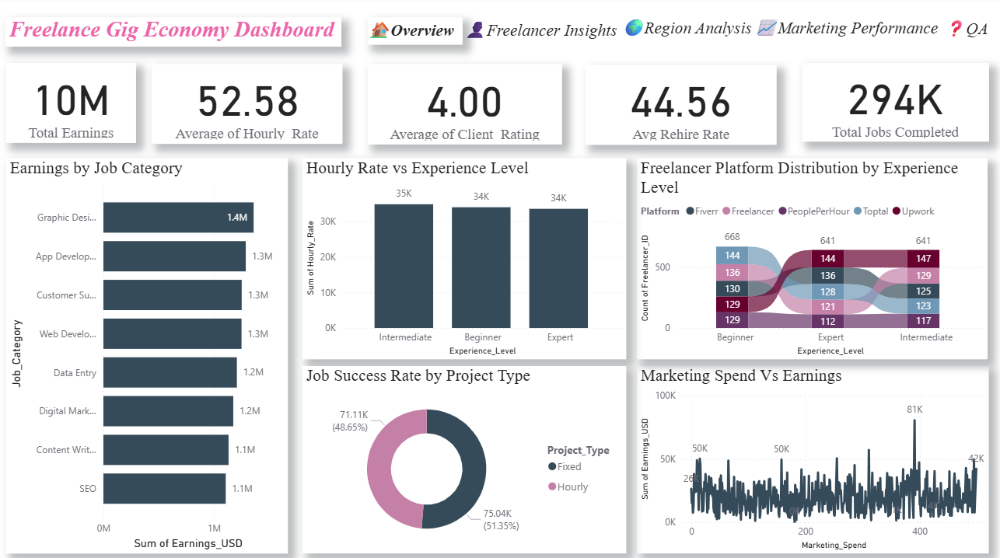

**Freelance Gig Economy Dashboard (2025) 📊**

This Power BI project explores the trends in the freelance gig economy using a dataset from Kaggle. The dashboard provides key insights into freelancer performance, earnings, marketing impact, client satisfaction, and regional distribution.

**🚀 Features**

\- Overview Section : Key metrics and trends about freelancers and jobs

\- Freelancer Insights : Performance, success rate, and hourly rate analysis

\- Regional Analysis : Client locations, earnings by region

\- Marketing Performance : ROI from self-promotion

\- QA Section : Natural language Q\&A powered by Power BI

**📊 Tools Used**

\- Microsoft Power BI

\- DAX (for measures and KPIs)

\- Power Query (for data transformation)

**📈 Key KPIs**

\- Total Earnings (USD)

\- Average Hourly Rate

\- Job Success Rate

\- Rehire Rate

\- Client Rating

**📌 Dataset Source**

\- Kaggle: Freelancer Earnings \& Job Trends 2025 Dataset  

(https://www.kaggle.com/code/sonawanelalitsunil/freelancer-earnings-job-trends-2025-ml/input?utm\_source=chatgpt.com)

**👨‍💻 Author**

Dona C 

MSc Computer Science  

\[LinkedIn Profile](https://www.linkedin.com/in/dona-c/)

**📁 Dataset Fields**

\- Freelancer ID, Job Category, Experience Level, Client Region, Earnings, Hourly Rate, Rating, Rehire Rate, Job Duration, etc.

**📸 Preview**

[Images Folder](./images/)

**📥 Download**

[Download FreelanceDashboard.pbix](./FreelanceDashboard.pbix)

---

**📥 How to Use**

1\. Clone the repository or download the `.pbix` file.

2\. Open in Power BI Desktop.

3\. Interact with the dashboard using filters and slicers.

**⭐ Star this repo if you find it helpful!**

